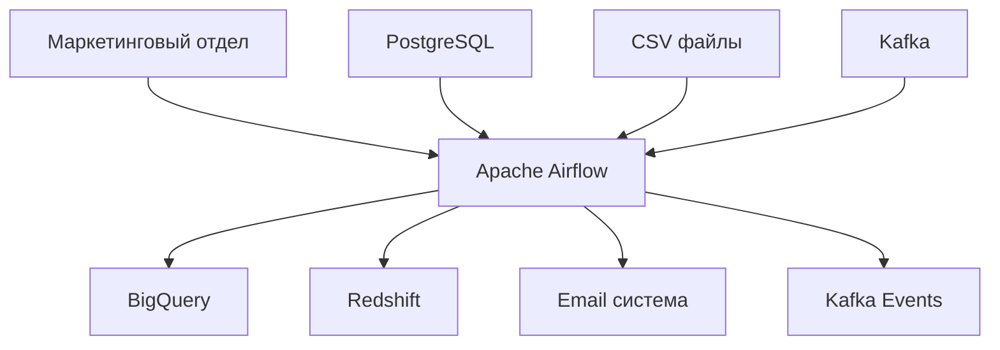
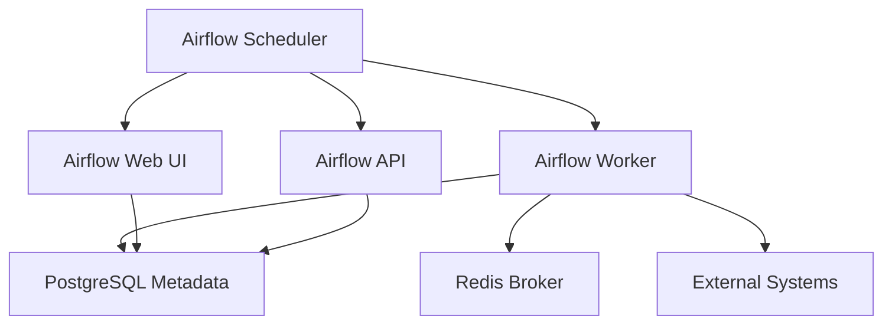

### **Название задачи:** 
Выбор и реализация решения для пакетной обработки данных маркетингового отдела

### **Автор:**
Rinat Muhamedgaliev

### **Дата:**
2025-09-29

### **Функциональные требования**

|**№**|**Действующие лица или системы**|**Use Case**|**Описание**|
| :-: | :- | :- | :- |
|1|Маркетинговый отдел|Обработка данных заказов|Извлечение данных о заказах из PostgreSQL, анализ статусов, формирование отчетов по успешным и проблемным заказам|
|2|Система мониторинга|Отправка уведомлений|Автоматическая отправка email-уведомлений при успешном/неуспешном выполнении пайплайна с CSV-вложениями|
|3|Аналитическая система|Интеграция с внешними хранилищами|Загрузка обработанных данных в BigQuery, Redshift для дальнейшего анализа|
|4|Система событий|Публикация событий|Отправка событий в Kafka о результатах обработки для других систем|
|5|Администратор|Мониторинг выполнения|Просмотр статуса выполнения пайплайнов через веб-интерфейс, анализ логов и метрик|

### **Нефункциональные требования**

|**№**|**Требование**|
| :-: | :- |
|1|Обработка до 1 млн записей за один запуск пайплайна|
|2|Горизонтальное масштабирование для увеличения пропускной способности|
|3|Retry-политики для обеспечения надежности обработки|
|4|Встроенный мониторинг и логирование всех операций|
|5|Поддержка ветвления и условной логики в пайплайнах|
|6|Интеграция с внешними API, BigQuery, Redshift, Kafka, Spark|
|7|Возможность развертывания в облачной среде|

### **Решение**

Также опишите, какой логикой вы руководствовались в ходе принятия решений и выбора технологий. Не забывайте, что необходимо учесть все функциональные и нефункциональные требования.

**Выбранное решение: Apache Airflow**

**Диаграмма контекста:**

**Диаграмма контейнеров:**

**Обоснование выбора Apache Airflow:**

1. **Богатая экосистема интеграций** - 400+ готовых операторов для BigQuery, Redshift, Kafka, Spark, PostgreSQL
2. **Встроенный мониторинг** - веб-интерфейс, метрики, логирование, алерты из коробки
3. **Масштабируемость** - поддержка CeleryExecutor, KubernetesExecutor для горизонтального масштабирования
4. **Ветвление и условная логика** - встроенная поддержка BranchPythonOperator и условных операторов
5. **Retry и fallback** - настраиваемые retry-политики, dead letter queues, email-уведомления
6. **Облачная готовность** - managed сервисы: Google Cloud Composer, AWS MWAA, Azure Data Factory

### **Альтернативы**

**Spring Batch:**
- Плюсы: 
  - Интеграция с Spring экосистемой
  - Встроенная поддержка транзакций
  - Хорошая производительность для Java-приложений
  - Поддержка chunk-based обработки
- Минусы: 
  - Привязка к Java/Spring экосистеме
  - Ограниченная поддержка Python и других языков
  - Сложность настройки для не-Java разработчиков
  - Менее гибкая система мониторинга
  - Ограниченная поддержка облачных интеграций
- Почему отклонен: 
  - Требуется более гибкая система оркестрации с поддержкой множественных языков
  - Необходима лучшая интеграция с облачными сервисами (BigQuery, Redshift)
  - Airflow предоставляет более богатую экосистему коннекторов для аналитических систем
  - Лучшая поддержка Python для data engineering задач

**Недостатки, ограничения, риски**

Подробно опишите здесь недостатки, ограничения и риски выбранного решения.

**Недостатки:**
1. **Кривая обучения** - сложность настройки и разработки сложных DAG'ов требует времени на изучение
2. **Избыточность для простых задач** - может быть излишне сложным для простых пайплайнов
3. **Требования к инфраструктуре** - необходимо настройка PostgreSQL, Redis, веб-сервера

**Ограничения:**
1. **Зависимость от внешних систем** - требует стабильной работы PostgreSQL, Redis, внешних источников данных
2. **Производительность при больших объемах** - может потребовать дополнительной настройки для обработки 1 млн+ записей
3. **Сложность отладки** - при сложных DAG'ах может быть трудно найти причину ошибок

**Риски:**
1. **Сложность настройки инфраструктуры** - требует экспертизы для правильной настройки
   - *Меры:* Использование Docker Compose для локальной разработки, managed сервисов для продакшена
2. **Производительность при больших объемах** - может не справиться с нагрузкой
   - *Меры:* Настройка CeleryExecutor, горизонтальное масштабирование воркеров, оптимизация DAG'ов
3. **Зависимость от внешних систем** - сбои в источниках данных могут нарушить работу
   - *Меры:* Реализация retry-политик, fallback-логики, мониторинга доступности внешних систем
