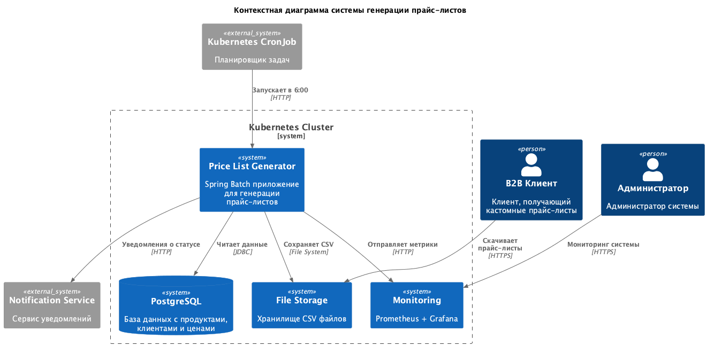
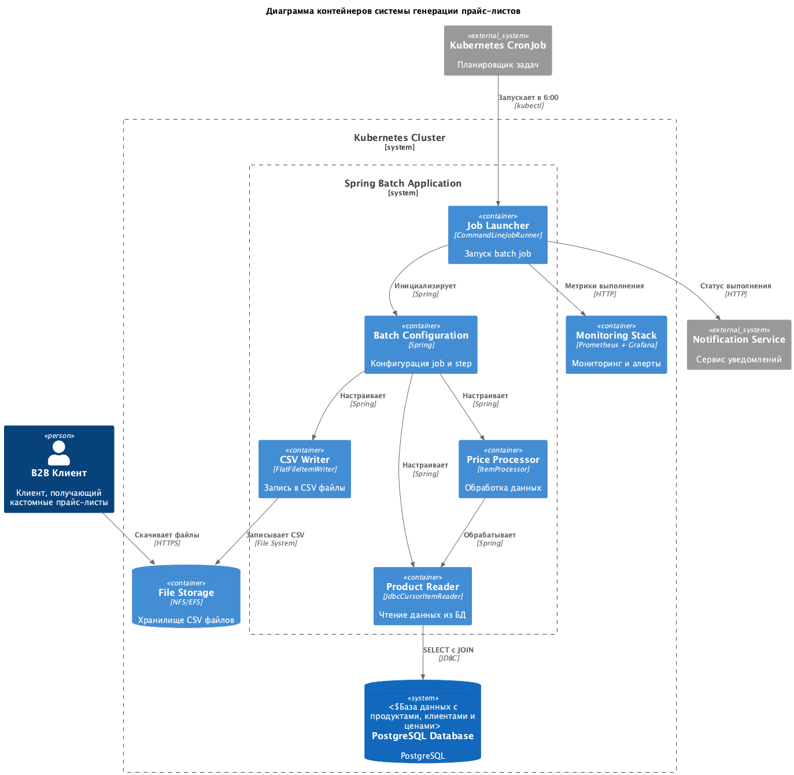
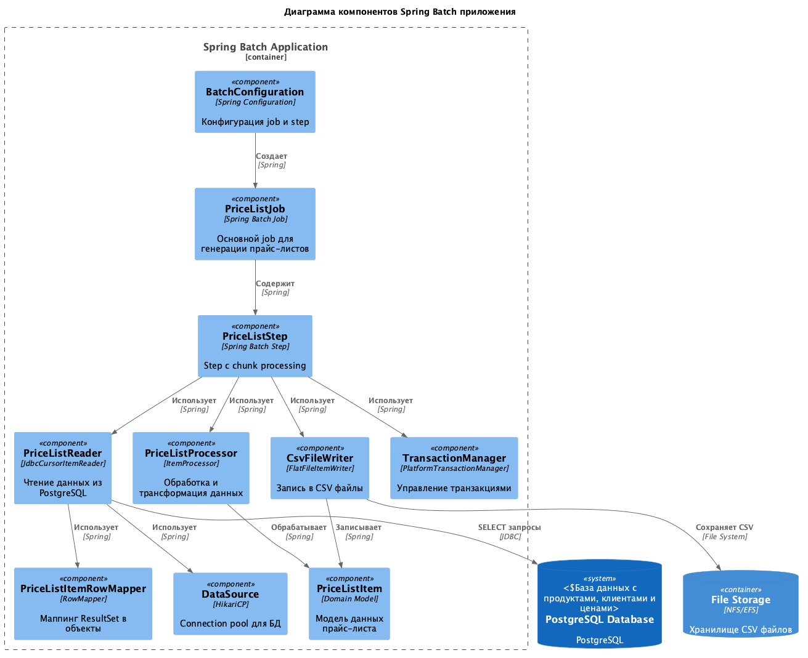
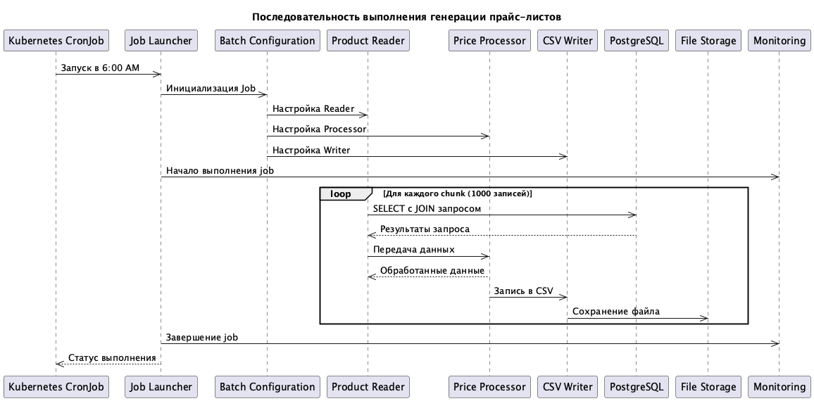

# ADR-002: Разработка дизайна модуля пакетной обработки данных для генерации прайс-листов

## **Название задачи:** 
Разработка дизайна модуля пакетной обработки данных для генерации кастомных CSV/XLS прайс-листов для B2B-клиентов

## **Автор:**
Rinat Muhamedgaliev

## **Дата:**
2025-01-27

## **Функциональные требования**

|**№**|**Действующие лица или системы**|**Use Case**|**Описание**|
| :-: | :- | :- | :- |
|1|Система планировщика|Запуск процесса генерации прайс-листов|Каждое утро в 6:00 система автоматически запускает процесс генерации прайс-листов|
|2|Модуль пакетной обработки|Извлечение данных из БД|Извлечение актуальных данных о продуктах, категориях, клиентах и ценах из PostgreSQL|
|3|Модуль пакетной обработки|Объединение данных|Связывание данных из таблиц products, categories, clients, client_prices|
|4|Модуль пакетной обработки|Генерация CSV файлов|Создание CSV файлов с прайс-листами для B2B клиентов|
|5|Система уведомлений|Уведомление о завершении|Отправка уведомления о успешном завершении или ошибке процесса|

## **Нефункциональные требования**

|**№**|**Требование**|
| :-: | :- |
|1|Обработка 5,000-10,000 строк данных ежедневно|
|2|Выполнение строго в 6:00 утра каждый день|
|3|Интеграция с микросервисной архитектурой в облаке|
|4|Минимальная сложность реализации (без дополнительной логики обработки)|
|5|Эффективное использование ресурсов|
|6|Простота развертывания и мониторинга|
|7|Надежность и отказоустойчивость|

## **Анализ технологических решений**

### Сравнительная таблица

|**Критерий**|**Spring Batch**|**Apache Airflow**|**K8s Job**|**Apache Spark**|
| :-: | :-: | :-: | :-: | :-: |
|**Наличие конфигурации CRON-расписания**|Высокая Spring Scheduler + @Scheduled|Высокая Встроенный планировщик|Высокая CronJob ресурс|Низкая Требует внешний планировщик|
|**Сложность реализации логики по обработке данных**|Низкая Готовые компоненты Reader/Processor/Writer|Средняя Python DAG + операторы|Низкая Простой скрипт/приложение|Высокая Сложная настройка для простых задач|
|**Ресурсоемкость решения**|Низкая ~100-200MB RAM, 0.1-0.2 CPU|Средняя ~500MB-1GB RAM, 0.5-1 CPU|Низкая ~50-100MB RAM, 0.1 CPU|Высокая ~1-2GB RAM, 1-2 CPU|
|**Масштабируемость решения под нагрузкой**|Средняя Вертикальное масштабирование|Высокая Горизонтальное + вертикальное|Высокая K8s auto-scaling|Высокая Кластерное масштабирование|
|**Сложность развертывания в облаке**|Низкая Spring Boot + Docker|Средняя Множество компонентов|Низкая Нативный K8s ресурс|Высокая Сложная конфигурация кластера|
|**Интеграция с микросервисной архитектурой**|Отличная Spring Boot экосистема|Хорошая REST API интеграция|Отличная Нативная K8s интеграция|Хорошая Требует дополнительной настройки|
|**Удобство интеграции с системами логирования и мониторинга**|Отличная Spring Actuator + Micrometer|Отличная Встроенные метрики и логи|Отличная K8s мониторинг|Хорошая Spark UI + внешние системы|

### Детальный анализ решений

#### 1. Spring Batch
**Преимущества:**
- Готовые компоненты для ETL операций
- Отличная интеграция с Spring Boot экосистемой
- Встроенная поддержка транзакций и откатов
- Простая конфигурация через аннотации
- Встроенная поддержка мониторинга через Actuator

**Недостатки:**
- Ограниченная горизонтальная масштабируемость
- Сложность настройки для очень больших объемов данных

#### 2. Apache Airflow
**Преимущества:**
- Мощный веб-интерфейс для мониторинга
- Отличная поддержка сложных DAG
- Встроенный планировщик
- Хорошая экосистема операторов

**Недостатки:**
- Избыточность для простой задачи
- Высокая ресурсоемкость
- Сложность развертывания (множество компонентов)
- Overhead для простых ETL операций

#### 3. Kubernetes Job
**Преимущества:**
- Нативная интеграция с K8s
- Простота развертывания
- Автоматическое управление жизненным циклом
- Минимальная ресурсоемкость

**Недостатки:**
- Необходимость реализации логики с нуля
- Отсутствие готовых компонентов для batch обработки
- Сложность реализации retry логики

#### 4. Apache Spark
**Преимущества:**
- Высокая производительность для больших данных
- Отличная масштабируемость
- Богатая экосистема

**Недостатки:**
- Избыточность для задачи 5-10K строк
- Высокая ресурсоемкость
- Сложность настройки и развертывания
- Overhead для простых операций

## **Решение**

### Выбранное решение: Spring Batch + Kubernetes CronJob

**Обоснование выбора:**

1. **Оптимальное соотношение простоты и функциональности**: Spring Batch предоставляет готовые компоненты для ETL операций, что идеально подходит для задачи без сложной логики обработки данных.

2. **Эффективное использование ресурсов**: Для объема 5,000-10,000 строк Spring Batch потребляет минимальные ресурсы (~100-200MB RAM), что экономически выгодно.

3. **Отличная интеграция с микросервисной архитектурой**: Spring Boot легко интегрируется с существующими микросервисами и может использовать общие библиотеки и конфигурации.

4. **Простота развертывания**: Docker контейнер с Spring Boot приложением легко развертывается в Kubernetes.

5. **Надежное планирование**: Kubernetes CronJob обеспечивает точное выполнение в 6:00 утра с возможностью retry при сбоях.

6. **Встроенный мониторинг**: Spring Actuator + Micrometer обеспечивают полный мониторинг без дополнительной настройки.

### C4 Диаграмма контекста (To Be)

### C4 Диаграмма контейнеров

### C4 Диаграмма компонентов

### Диаграмма последовательности

## **Альтернативы**

### Apache Airflow
**Почему не выбрали:**
- Избыточность для простой ETL задачи
- Высокая ресурсоемкость (500MB-1GB RAM)
- Сложность развертывания (множество компонентов)
- Overhead для задачи без сложной логики

### Kubernetes Job (без Spring Batch)
**Почему не выбрали:**
- Необходимость реализации всей логики с нуля
- Отсутствие готовых компонентов для batch обработки
- Сложность реализации retry и error handling
- Дублирование функциональности

### Apache Spark
**Почему не выбрали:**
- Избыточность для объема 5-10K строк
- Высокая ресурсоемкость (1-2GB RAM)
- Сложность настройки кластера
- Overhead для простых операций

## **Недостатки, ограничения, риски**

### Недостатки выбранного решения:
1. **Ограниченная горизонтальная масштабируемость**: Spring Batch лучше подходит для вертикального масштабирования
2. **Зависимость от Spring экосистемы**: Привязка к Spring Boot может ограничить гибкость
3. **Сложность настройки для очень больших объемов**: При росте данных свыше 100K строк может потребоваться пересмотр архитектуры

### Ограничения:
1. **Объем данных**: Решение оптимально для 5-50K строк, при росте может потребоваться оптимизация
2. **Время выполнения**: При больших объемах может превысить допустимое время выполнения
3. **Память**: Ограничена доступной памятью контейнера

### Риски:
1. **Риск превышения времени выполнения**: При росте данных job может не успеть выполниться
2. **Риск нехватки ресурсов**: При пиковых нагрузках может не хватить CPU/памяти
3. **Риск потери данных**: При сбое во время записи CSV файлов

### Меры по снижению рисков:
1. **Мониторинг производительности**: Настройка алертов на время выполнения и использование ресурсов
2. **Graceful degradation**: Реализация fallback механизмов при сбоях
3. **Backup стратегия**: Регулярное резервное копирование сгенерированных файлов
4. **Retry механизм**: Автоматические повторы при временных сбоях
